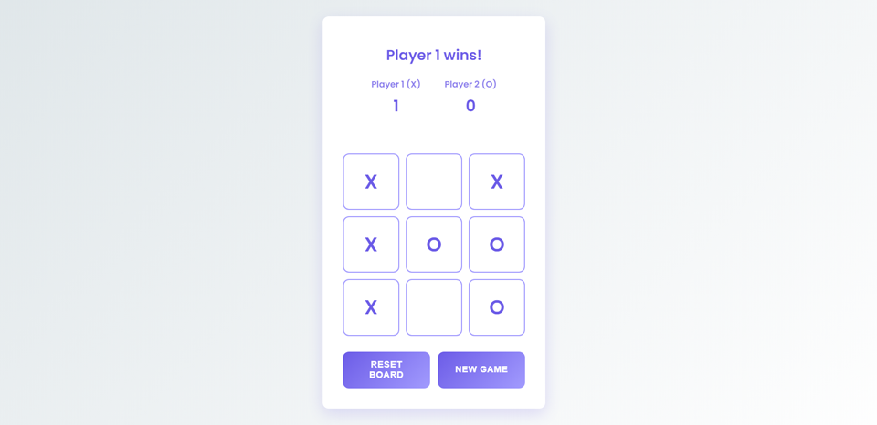

# Modern Tic-Tac-Toe



A sleek, modern implementation of the classic Tic-Tac-Toe game built with HTML, CSS, and JavaScript. This version features a clean, responsive design with smooth animations and an intuitive user interface.

## Features

- 🎮 Clean, modern UI with smooth animations
- 👥 Customizable player names
- 📊 Score tracking system
- 🔄 Reset board while keeping scores
- 🆕 New game option to start fresh
- 📱 Fully responsive design
- 🎯 Win detection with visual feedback
- 🤝 Draw detection
- ✨ Hover effects and interactive feedback

## Technologies Used

- HTML5
- CSS3 (with modern features like CSS Grid and Flexbox)
- JavaScript (ES6+)
- Google Fonts (Poppins)

## How to Play

1. Enter custom names for both players (or use defaults)
2. Click "Start Game" to begin
3. Players take turns clicking cells to place their X or O
4. First player to get three in a row wins!
5. Use "Reset Board" to play another round
6. Use "New Game" to start fresh with new players

## Installation

Simply clone the repository and open `index.html` in your browser:

```bash
git clone [repository-url]
cd modern-tic-tac-toe
```

## License

MIT License - feel free to use this code for your own projects!
